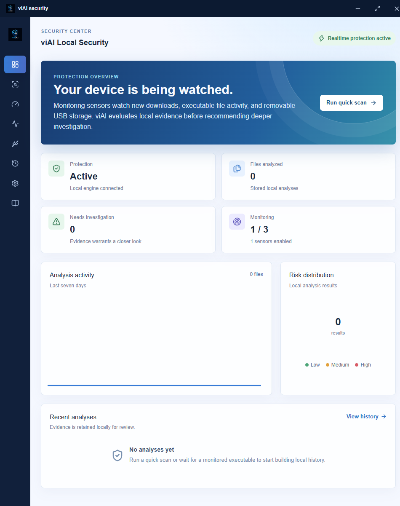
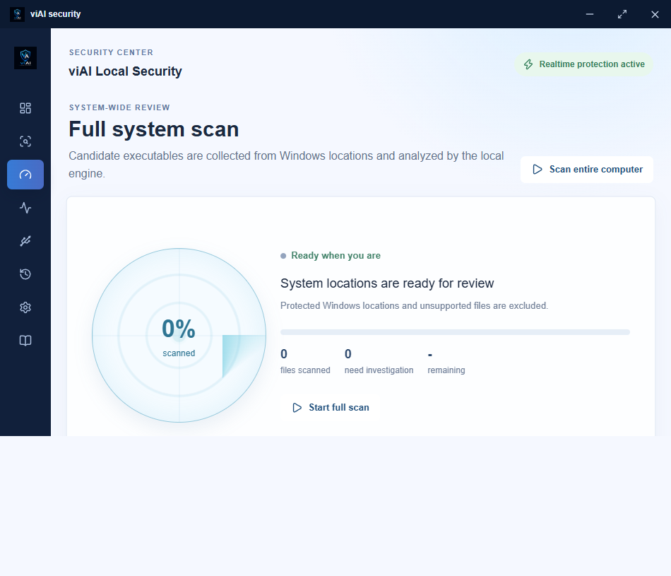

# viAI Security Engine

**Local security visibility for Windows endpoints.**

viAI Security Engine helps security-conscious teams review suspicious files and device activity without sending files or evidence outside the device. It combines a focused desktop workspace with local static analysis, configurable monitoring, and investigation-priority scoring.

*The viAI dashboard presents protection status, local analysis activity, investigation priorities, and monitoring coverage in one place.*

## Security Visibility, Kept Local

viAI is designed for situations where privacy and control matter. It analyzes local evidence to determine whether a file deserves closer investigation; it does not execute samples, upload files, or claim to provide a malware verdict.

- **Private by design**: File reads, hashes, metadata, reports, and reputation data remain on the device.
- **Investigation-focused**: Results are prioritized as low, medium, or high based on collected evidence and configured rules.
- **Built for Windows workflows**: Review files on demand, scan selected locations, monitor relevant activity, and retain local history for follow-up.

## Desktop Experience

The desktop app brings the core security workflow into a single, focused workspace:

- **Dashboard**: Live protection state, monitored-sensor coverage, analysis activity, risk distribution, and recent results.
- **Quick Scan**: Inspect an individual file or folder when a user, alert, or investigation calls for it.
- **Full System Scan**: Collect and review executable candidates from selected Windows locations with progress, estimates, and investigation counts.
- **Realtime Protection**: Configure local monitoring for downloads, executable activity, USB storage, notifications, exclusions, and performance policy.
- **Device Security**: Review connected devices, set trust, block devices, and inspect removable-media scan findings.
- **History**: Keep local reports, trust evidence, rule matches, and recommendations available for review and export.

*The full system scan keeps progress, current status, and investigation priority visible while analysis continues locally.*

## What viAI Monitors

viAI can monitor three primary local signals when enabled:

| Sensor | What it observes |
| --- | --- |
| Downloads | New files from configured download locations that require local review. |
| Executable activity | Supported executable and script changes in configured directories. |
| Removable storage | USB storage and removable-media activity managed through the desktop device-security experience. |

Monitoring policy is configurable from the desktop app. Settings, exclusions, and recorded activity stay on the local device.

## Evidence-Based Prioritization

Each analysis brings together available static evidence, including file hashes, metadata, entropy, Authenticode information, PE imports and sections, packer indicators, local reputation, and editable VRL rules. viAI turns that evidence into an investigation priority, not a malware probability.

| Score | Priority | Recommended response |
| --- | --- | --- |
| 0-25 | Low | Retain local evidence; no immediate follow-up is indicated. |
| 26-60 | Medium | Review the evidence and consider an investigation workflow. |
| 61-100 | High | Prioritize the item for deeper investigation, sandboxing, or approved analyst review. |

## Privacy and Operating Model

- The local service binds only to `127.0.0.1`.
- viAI does not upload files, execute samples, or perform cloud-dependent classification.
- Local reports can be reviewed and exported from the desktop history experience.
- Decisions are recommendations for further investigation; viAI does not delete, quarantine, or alter files.

## Availability

viAI Security Engine is delivered as a Windows desktop application. Use the installer supplied with your approved viAI distribution for deployment and updates.

## Technical Reference

For architecture and rule-engine details, see [Architecture](docs/architecture.md), [Rule Engine Architecture](docs/rule-engine-architecture.md), and [Trust Assessment Architecture](docs/trust-assessment-architecture.md).