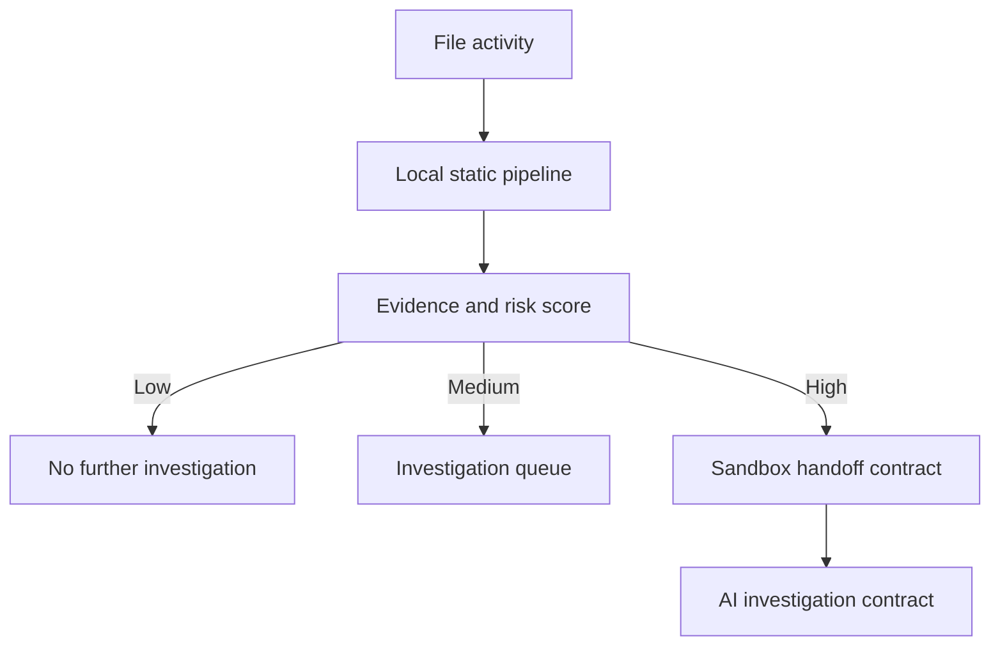
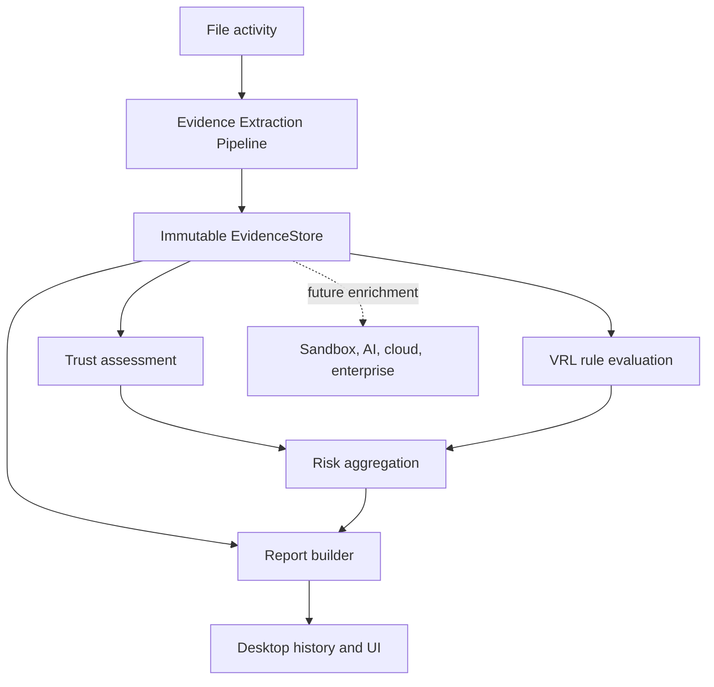

# Architecture

`watcher/` turns download, filesystem, and removable-media activity into typed `FileActivityEvent` messages. `core/eventManager` invokes `core/pipeline`, which performs static collection only. The pipeline composes analyzers, local reputation, compiled VRL rules, and risk aggregation into `AnalysisResult`.

## Local Privacy Boundary

All reads are local file reads. The engine performs no HTTP egress, no file upload, and no sample execution. The only server binds to `127.0.0.1`. Active local security state, including hashes and last-seen metadata, is stored in SQLite at Electron `app.getPath("userData")/viai.db`.

## Evidence and Scoring

The reusable Rule Engine compiles `.vrl` files from `rules/` and its policy categories at startup. Each compiled rule contributes evidence, a score, and optional investigation routing; `RiskAggregator` clamps the total to 0-100 and chooses the highest routing recommendation. See [rule-engine-architecture.md](rule-engine-architecture.md).

## Evidence Extraction

`src/evidence/EvidenceExtractionPipeline` is the static-analysis boundary. It reads a file into one in-memory snapshot, executes independent collectors sequentially, and returns an immutable `EvidenceStore`. The default collectors extract hashes, metadata, PE structure, Authenticode details, entropy, filesystem provenance, and packing facts. PE parsing, hashing, entropy calculation, and metadata detection all consume the shared bytes rather than opening the scanned file again.

Collectors receive a snapshot and the current store, never call one another, and return a new immutable store. The pipeline emits collector start, finish, failure, duration, and completion events through `AnalysisPipeline.onEvidenceEvent()`. It caches completed evidence by path, source, file size, and modification time; a matching later scan reuses the store without rereading the file. The final store is included additively in `AnalysisResult`, so the existing desktop history persistence retains it with scan reports.

Windows Authenticode validation and `Zone.Identifier` inspection remain platform operations that require a path: the former delegates to Windows trust policy and the latter is a separate NTFS alternate data stream. They are isolated collectors and do not cause hashing, entropy, metadata, or PE parsing to reopen the main file.

## Platform Notes

Authenticode validation and removable-drive enumeration use Windows facilities when running on Windows. On other systems, signatures are reported as `unknown` and USB enumeration returns no drives. Parent process attribution is exposed in the event model and execution-attempt API; production kernel or ETW integration should supply it.