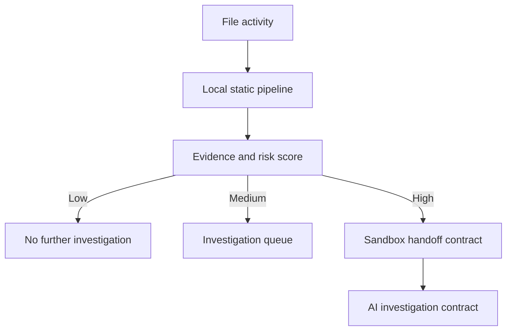

# Architecture

`watcher/` turns download, filesystem, and removable-media activity into typed `FileActivityEvent` messages. `core/eventManager` invokes `core/pipeline`, which performs static collection only. The pipeline composes analyzers, local reputation, JSON rules, and weighted scoring into `AnalysisResult`.

## Local Privacy Boundary

All reads are local file reads. The engine performs no HTTP egress, no file upload, and no sample execution. The only server binds to `127.0.0.1`. Hashes and last-seen metadata are saved locally in `database/reputation.json`; it is intentionally ignored by Git.

## Evidence and Scoring

`scoring/riskEngine.ts` applies the following maximum contributions: reputation 30%, signature 20%, PE imports 20%, entropy 10%, packer indicators 10%, and rule findings 10%. Trusted-rule reductions may lower the final score. Rules are data files under `rules/`, enabling review and versioned policy changes without modifying analyzer code.

## Platform Notes

Authenticode validation and removable-drive enumeration use Windows facilities when running on Windows. On other systems, signatures are reported as `unknown` and USB enumeration returns no drives. Parent process attribution is exposed in the event model and execution-attempt API; production kernel or ETW integration should supply it.