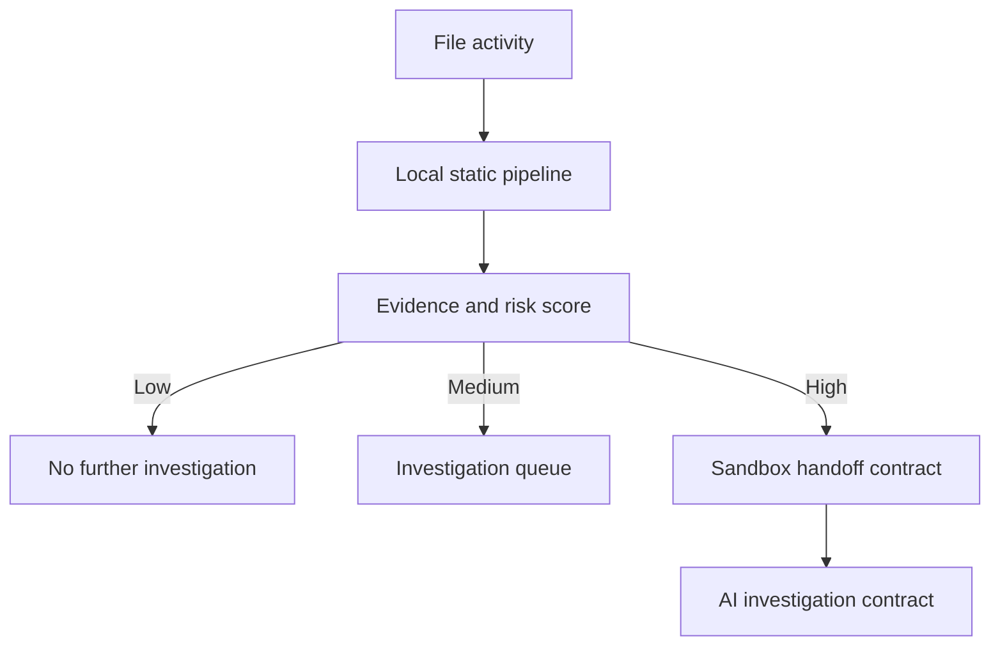

# Architecture

`watcher/` turns download, filesystem, and removable-media activity into typed `FileActivityEvent` messages. `core/eventManager` invokes `core/pipeline`, which performs static collection only. The pipeline composes analyzers, local reputation, compiled VRL rules, and risk aggregation into `AnalysisResult`.

## Local Privacy Boundary

All reads are local file reads. The engine performs no HTTP egress, no file upload, and no sample execution. The only server binds to `127.0.0.1`. Hashes and last-seen metadata are saved locally in `database/reputation.json`; it is intentionally ignored by Git.

## Evidence and Scoring

The reusable Rule Engine compiles `.vrl` files from `rules/` and its policy categories at startup. Each compiled rule contributes evidence, a score, and optional investigation routing; `RiskAggregator` clamps the total to 0-100 and chooses the highest routing recommendation. See [rule-engine-architecture.md](rule-engine-architecture.md).

## Platform Notes

Authenticode validation and removable-drive enumeration use Windows facilities when running on Windows. On other systems, signatures are reported as `unknown` and USB enumeration returns no drives. Parent process attribution is exposed in the event model and execution-attempt API; production kernel or ETW integration should supply it.