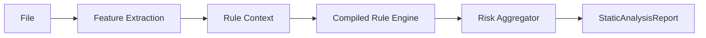

# Rule Engine Architecture

## Scope and Boundary

The Local Security Engine is a static evidence and investigation-priority system. It extracts features, evaluates policy, aggregates risk, and recommends the next step. It does not classify a file as malware or name a malware family.

The replacement flow is:



`Feature Extraction` is responsible for facts only. `Rule Engine` is responsible for matching policy. `Risk Aggregator` is responsible for a bounded score, ordered recommendation, matched results, and indicators. No parser, HTTP controller, or analyzer is allowed to make an investigation recommendation.

## Package Layout

The reusable policy component will be introduced as `packages/core/src/rules/`. It is intentionally independent of Node HTTP, Electron, file watchers, and viAI-specific analyzers. The Local Security Engine will remain an adapter that creates a `RuleContext` from its analysis results and consumes `StaticAnalysisReport`.

```text
packages/core/src/rules/
  Rule.ts                 Public rule and compiled-rule contracts
  RuleResult.ts           Match result contracts
  RuleContext.ts          Immutable feature context contracts
  RuleParser.ts           Source-format parser port
  RuleCompiler.ts         AST-to-compiled-rule port
  RuleLoader.ts           Recursive policy discovery and diagnostics
  RuleRegistry.ts         Immutable compiled catalog and indexes
  RuleCache.ts            Startup cache and atomic snapshot replacement
  RuleEvaluator.ts        Compiled-rule evaluation only
  RuleEngine.ts           Composition root for policy loading and evaluation
  vrl/
    VrlLexer.ts
    VrlParser.ts
    VrlAst.ts
    VrlRuleParser.ts
  aggregation/
    RiskAggregator.ts
```

The initial root-project integration may import this package through a TypeScript project reference. Moving it to a published workspace package later must not change the public contracts.

## Core Contracts

Phase 2 will implement the following interfaces. They are contracts, not runtime behavior in this phase.

```ts
type Recommendation = "ALLOW" | "MONITOR" | "SANDBOX" | "AI_ANALYSIS";

interface RuleContext {
  readonly file: FileFeatures;
  readonly signature: SignatureFeatures;
  readonly pe: PeFeatures;
  readonly source: SourceFeatures;
  readonly reputation: ReputationFeatures;
}

interface RuleResult {
  readonly id: string;
  readonly matched: boolean;
  readonly score: number;
  readonly severity: "low" | "medium" | "high";
  readonly evidence: string;
  readonly recommendation?: Recommendation;
}

interface StaticAnalysisReport {
  readonly fileHash: string;
  readonly riskScore: number;
  readonly recommendation: Recommendation;
  readonly matchedRules: readonly RuleResult[];
  readonly indicators: readonly string[];
  readonly metadata: unknown;
}

interface RuleParser<TSource = string> {
  readonly format: string;
  parse(source: TSource, origin: RuleOrigin): ParseResult;
}
```

`RuleContext` contains facts such as `file.isExecutable`, `file.entropy`, `signature.isSigned`, `pe.imports`, and `source.kind`. It contains no derived risk score or recommendation. This prevents a feature extractor from becoming an implicit policy engine.

## VRL Policy Model

VRL is the first `RuleParser` implementation. A `.vrl` source file becomes an AST, then a `CompiledRule` predicate. Scans call predicates only; they never lex, parse, or compile policy.

The initial language supports rule metadata, `when` boolean expressions, numeric comparisons, equality, negation, parentheses, and collection membership. The supported syntax is deliberately small and typed before it is expanded.

```vrl
rule PackedUnsignedExecutable

description
Unsigned executable packed with high entropy.

when
file.isExecutable
and
!signature.isSigned
and
file.entropy > 7.2
and
pe.imports contains "VirtualAlloc"

score
30

severity
medium

recommendation
SANDBOX

evidence
"Unsigned executable packed with suspicious imports."
```

The lexer emits tokens and source spans. The parser produces syntax and diagnostics. The compiler validates field paths and operand types against a feature-schema catalog, then produces a side-effect-free predicate. Rule policy decisions remain in compiled rules and the aggregation policy, never in the lexer or parser.

## Registry, Loading, and Cache

At startup, `RuleLoader` recursively discovers every `.vrl` file below the configured policy root:

```text
rules/
  static/
  network/
  powershell/
  registry/
  memory/
  persistence/
```

Nested folders are supported. New `.vrl` files need no registration. The loader associates the `vrl` extension with `VrlRuleParser` through a parser registry; future YAML, JSON, or YARA adapters implement `RuleParser` without modifying `RuleEngine`.

`RuleRegistry` stores an immutable snapshot of compiled rules and indexes by referenced feature path. `RuleCache` publishes a fully compiled snapshot atomically. Evaluation holds one snapshot for its entire request, so concurrent scans cannot observe a partial reload. In Node this is implemented with immutable references; a future worker-thread host uses the same snapshot contract rather than shared mutable rule state.

Invalid required rules fail policy initialization with origin, line, column, and diagnostic code. A reload retains the last known-good snapshot when a replacement catalog fails compilation. This prevents silently running a partial or unknown policy set.

## Evaluation and Aggregation

`RuleEvaluator` receives a compiled snapshot and a `RuleContext`. It evaluates only candidate predicates and returns one `RuleResult` for every matched rule. The evaluator does not sum scores, cap values, select escalation, or mutate registry state.

`RiskAggregator` is the only owner of aggregation policy:

1. Sum matched rule scores and clamp the result to $0 \ldots 100$.
2. Deduplicate evidence into `indicators` while preserving deterministic rule order.
3. Select the highest explicit matched-rule recommendation using `ALLOW < MONITOR < SANDBOX < AI_ANALYSIS`.
4. If no rule supplies a recommendation, use the configured score-band policy.
5. Emit `StaticAnalysisReport` with the file hash and supplied metadata.

All existing contributors, including signature, reputation, entropy, PE imports, packer signals, and acquisition source, become typed features. Any risk contribution or recommendation based on those features must be expressed as a rule. This removes the former split policy path and keeps the report limited to investigation routing.

## Local Engine Integration

The migration changes `AnalysisPipeline` in one direction only:

```text
existing analyzers + reputation lookup
  -> RuleContext factory
  -> RuleEngine.evaluate(context)
  -> RiskAggregator.aggregate(results, hash, metadata)
  -> AnalysisResult adapter / StaticAnalysisReport
```

The public loopback API may continue to return its current envelope during migration, but `decision` and `recommendation` will be sourced from `StaticAnalysisReport`. The adapter must use neutral language such as `ALLOW`, `MONITOR`, `SANDBOX`, or `AI_ANALYSIS`; it must not emit malware-family or malware-classification terms.

The legacy JSON loader and `rules/*.json` files are removed only in the final integration slice after equivalent VRL rules and parity tests exist. There is no permanent compatibility execution path for JSON policy.

## Performance and Test Strategy

Compilation occurs at startup or explicit reload only. Scan-time work is bounded to context construction, indexed candidate selection, predicate calls, and aggregation. Rule sources, ASTs, and compiled snapshots are immutable after publication.

Each implementation phase adds focused tests before integration:

| Phase | Verification |
| --- | --- |
| Contracts | Type-level and recommendation-order tests |
| Registry and loader | Recursive discovery, extension dispatch, duplicate-ID, and invalid-catalog tests |
| Lexer and parser | Token span, AST shape, precedence, and diagnostic tests |
| Compiler and evaluator | Type validation, predicate truth-table, and no-parse-at-scan tests |
| Aggregator | Score clamp, evidence deduplication, and recommendation precedence tests |
| Pipeline | VRL parity fixtures, unified report contract, and no-malware-language API tests |

This document is Phase 1 only. No production rule behavior changes until the contracts and tests in the next phase are in place.