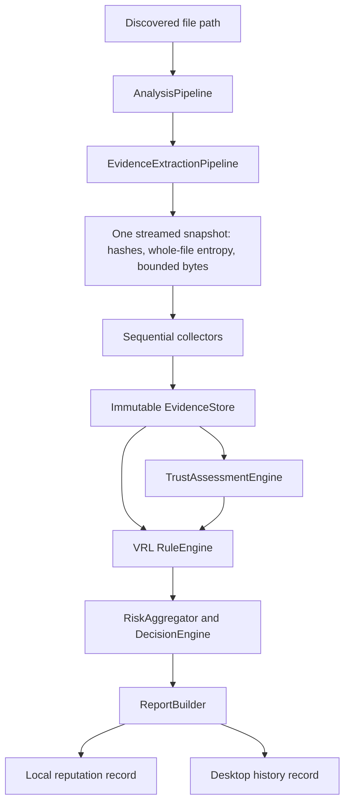

# Static Engine Audit

## Scope and Method

This audit describes the repository state at the start of the v0.3.x static-engine hardening work. It traces the implementation, not the intended architecture. Findings marked **verified** were confirmed from code and existing tests. Findings marked **gap** are unsupported, incomplete, or produce an incorrect security interpretation. No executable samples or filename allowlists were used.

## Actual Architecture

The sequence differs slightly from the intended fan-out: trust runs before the rule engine because the rule engine receives the completed trust result. The report builder consumes the evidence store and static report after the decision. The desktop persists a full report separately from the engine's compact local reputation database.

## Stage-by-Stage Findings

| Stage | Implementation | Input and output | Reads / failures | Audit finding |
| --- | --- | --- | --- | --- |
| Discovery / scheduling | `src/watcher`, desktop scan services, `AnalysisPipeline.analyze` | Path and optional source; resolves path | Scheduling is bounded by `AnalysisLimiter` (default 2) | **Verified:** scheduler is outside static evidence collection. This audit does not alter its prioritization. |
| Snapshot | `src/evidence/evidenceExtractionPipeline.ts` | Path; `EvidenceSnapshot` with stats, SHA-256/SHA-1/MD5, whole-file entropy, up to 16 MiB bytes | One `stat`, one `lstat`, one streaming main-file read; errors reject extraction | **Verified:** hashes and whole-file entropy are computed in the same stream. The 16 MiB snapshot is intentionally truncated, so PE parsing is incomplete for larger files whose relevant structures fall after that range. |
| Metadata / classification | `MetadataEvidenceCollector`, `extractMetadataFromSnapshot` | Snapshot stats and first eight bytes; metadata and coarse type | No extra main-file read; collector failure is recorded | **Verified:** default pipeline uses the snapshot-safe function. **Gap:** type classification is extension/header coarse and does not distinguish MSI, SYS, scripts, documents, archives, or shortcut semantics. |
| PE parse | `PeEvidenceCollector`, `parsePe` | Snapshot bytes; `PeMetadata`, sections, imports | No extra file read; increments `peParseCount` once | **Verified:** shared snapshot is used. **Gap:** no parse status, partial warning, directory bounds model, or distinction between malformed, unsupported, and non-PE. |
| Signature | `SignatureEvidenceCollector`, `analyzeSignature` | Path; Authenticode status and certificate details | Separate PowerShell process opens the path; errors return `unknown`/`Unavailable` details | **Verified:** this is intentionally path-based and uses Windows policy. **Gap:** public state has only `trusted`, `missing`, `invalid`, `unknown`; it cannot accurately represent valid-but-untrusted, expired, revoked, self-signed, unavailable, or verification error. |
| Entropy | Snapshot reader and `EntropyEvidenceCollector` | Stream byte counts; one whole-file Shannon value | No extra file read; collector cannot normally fail | **Verified:** Shannon calculation is mathematically correct. **Gap:** the rule context drops section entropy, so resource, overlay, and executable-code entropy cannot be distinguished. |
| Filesystem evidence | `FileSystemEvidenceCollector`, `fileSystemEvidenceCollector.ts` | Link stat and path; symlink, dot-hidden, Zone.Identifier | Reads Windows ADS separately; failures silently become missing Zone.Identifier | **Gap:** Zone.Identifier absence and read failure are indistinguishable. Path is later treated as trust context without signer/baseline corroboration. |
| Packer | `PackerEvidenceCollector`, `packerDetector.ts` | Parsed PE metadata; generic `PackerFinding` | No additional read | **Gap:** packing is treated as direct negative trust and a sandbox rule without visibility-confidence or contextual classification. |
| Evidence store | `EvidenceStore` in `src/types.ts` | Collector output; immutable store plus processing metadata | Collector errors are recorded in warnings and metadata | **Gap:** a failed required collector is later rejected by `requireEvidence`, so the pipeline records a collector failure but cannot produce a degraded report. |
| Local reputation | `LocalReputationDatabase` | SHA-256; one record with first observed name, status, risk level, last seen | JSON read/write; malformed JSON is renamed | **Gap:** no baseline state, first-seen timestamp, scan count, signature history, rule-set version, or decision invalidation. "Previously observed" is correctly weak today, but persistence does not retain enough evidence for change detection. |
| Trust | `TrustAssessmentEngine`, evaluators, `createTrustContextFromEvidence` | Evidence store and reputation; immutable weighted indicators | No file reread | **Gap:** `isSigned` means only `trusted`; unavailable, invalid, and unsigned are all false. `StaticEvidenceTrustEvaluator` therefore emits `UNSIGNED_BINARY` for unavailable verification. |
| Rules | `RuleEngine`, VRL rules, `createRuleContextFromEvidence` | Simplified context plus trust result; matched weighted rules | No file reread | **Gap:** all rule scores are additive, with no correlation group, category cap, evidence strength, or minimum strong-evidence gate. |
| Aggregate / confidence | `RiskAggregator` | Matched rules and trust | No file reread | **Gap:** risk is a capped sum and confidence is `25 + 20 * rule count + 8 * trust indicator count`; it measures matching volume rather than evidence completeness or reliability. |
| Recommendation | `DecisionEngine` | Risk, trust, confidence, matched rule recommendations | No file reread | **Gap:** the baseline is driven by risk thresholds and a rule can only escalate. Confidence is accepted but unused. A weak rule can force `SANDBOX`. |
| Reporting / history | `ReportBuilder`, desktop `BackgroundService` | Evidence, static report, scan record | No source-file reread | **Gap:** report language labels a score as risk and export derives priority from score only. Existing history does retain complete report objects, but engine/rule/schema versions are not consistently separated. |

## Parse-Once Verification

The main file content is streamed exactly once by `LocalEvidenceSnapshotReader` for a cache miss. The stream calculates all hashes and whole-file entropy while retaining at most 16 MiB for metadata and PE parsing. The default collectors consume those retained bytes and the collected stats:

- `hash`: snapshot hash values.
- `metadata`: snapshot stats and header bytes.
- `portable-executable`: snapshot bytes, one parse.
- `entropy`: snapshot entropy value.
- `packer`: parsed PE metadata.

The processing metadata correctly reports `fileReadCount: 1` and `peParseCount: 1` for a non-cached analysis. The existing `evidence-extraction-pipeline` test verifies this behavior. A cache hit reports zero fresh main-file reads.

There are necessary path operations outside the snapshot:

- `stat` / `lstat` validate and describe the file.
- Windows `Get-AuthenticodeSignature` verifies the file through the platform trust subsystem.
- Windows Zone.Identifier is an alternate-data-stream read.

These should remain separate because signature and ADS validation are platform operations. The standalone `analyzePe`, `analyzeEntropy`, `extractMetadata`, and filesystem helpers can read paths independently, but the default pipeline does not call those path-reading variants. The static engine should continue using the snapshot variants.

## PE Parser Audit

`src/analyzer/peAnalyzer.ts` safely catches exceptions and checks many individual buffer reads. It currently extracts:

- DOS MZ and PE signatures.
- COFF machine, section count, and compilation timestamp.
- PE32 versus PE32+ optional-header magic.
- entry point, image base, subsystem, checksum, image size, selected DLL characteristics.
- section table values, permissions, and entropy.
- import names, a boolean export-directory presence, CLR-directory presence, and an approximate overlay size.

### Verified strengths

- Main header reads use `hasBytes` before direct reads.
- Section data is sliced only when its declared range is within the retained buffer.
- Import descriptor and thunk loops are bounded.
- Exceptions return a non-throwing result with a warning.

### Correctness and coverage gaps

- A malformed or truncated section table silently stops parsing; it does not emit a partial parse warning.
- Directory RVAs are read without their directory sizes and without a structured warning if they resolve outside the mapped image.
- Resource, certificate/security, debug, relocation, and full CLR directory information is not extracted.
- The certificate directory is especially important because it can contextualize Authenticode, but Windows trust remains the authoritative verifier.
- `rvaToOffset` does not distinguish virtual-only data from raw-backed data, and import parsing lacks warning output for invalid RVAs, names, or truncated descriptors.
- `overlaySize` is approximate and cannot distinguish a legitimate installer payload or signature/certificate data from an unexpected overlay.
- There is no `VALID`, `PARTIAL`, `MALFORMED`, `UNSUPPORTED`, or `NOT_PE` status. The current `isPe: false` plus text warning conflates these states.
- Compilation timestamps are converted directly to ISO strings and have no plausibility metadata. They are not currently a rule input, which avoids one false-positive path, but the parser cannot explain unusual values.
- Only one happy-path synthetic fixture exercises PE parsing. There are no PE32+, malformed, out-of-bounds, partial, resource, certificate, debug, relocation, or timestamp regression fixtures.

## Entropy and Section Analysis Audit

The Shannon implementation in `entropyFromCounts` is correct for a byte distribution. Whole-file entropy is calculated in the snapshot stream and per-section entropy is calculated from each available raw section. The existing test covers repeated bytes only.

The current `HighFileEntropy` rule applies `+15`, `medium`, and `MONITOR` at whole-file entropy >= 7.2. It cannot tell whether entropy is concentrated in a `.rsrc` section, an overlay, compressed installer payload, or executable code. Separately, `StaticEvidenceTrustEvaluator` applies `HIGH_ENTROPY: -8` and `PACKED_BINARY: -10`, allowing correlated visibility signals to reduce trust as well as increase risk.

This is a verified score-inflation path for installers and games. Entropy must become supporting context, with executable-section, resource, and overlay entropy carried into the canonical evidence and evaluated as one correlated category.

## Signature and Trust Audit

The current analyzer calls `Get-AuthenticodeSignature` with an explicit PowerShell script-block parameter. A Windows integration test verifies that the inbox signed `powershell.exe` is mapped to `trusted` with Microsoft certificate details.

### Verified strengths

- The verifier delegates signature policy to Windows rather than only inspecting a certificate table.
- The latest test caught and fixed a previous argument-passing defect that caused all results to become `unknown`.
- Missing signatures are represented as `status: "missing"` when PowerShell returns `NotSigned`.

### Critical gaps

- `UnknownError` is mapped to `invalid`, even though it can represent an unsupported/non-PE file or a verification failure rather than a cryptographically invalid signature.
- The result schema does not distinguish signed-valid-but-untrusted, expired, revoked, self-signed, unavailable, and verification error.
- `details.present` is inferred from `status !== "NotSigned"`; it can therefore state that a signature is present after an unknown verification result.
- `createTrustContext` sets `isSigned` only for `trusted`. `StaticEvidenceTrustEvaluator` then labels every other state `UNSIGNED_BINARY`, including verification unavailable and invalid signatures.
- `UnsignedDownloadExecutable` uses `!signature.isSigned`; a verification-unavailable executable in Downloads is treated as unsigned and immediately forces `SANDBOX`.
- Catalog signatures and system-file signing scenarios are not represented beyond whatever `Get-AuthenticodeSignature` returns.

The next signature phase must introduce a canonical status model that preserves presence, validity, trust, timestamp, revocation, and verification availability without converting uncertainty into unsigned evidence.

## Rule, Score, and Recommendation Audit

Current rules are:

| Rule | Current score / action | Evidence strength assessment | Issue |
| --- | --- | --- | --- |
| `UnsignedDownloadExecutable` | +20 / `SANDBOX` | contextual, weak | Treats unavailable verification as unsigned and forces escalation. |
| `HighFileEntropy` | +15 / `MONITOR` | weak, supporting | Whole-file entropy conflates code, resources, archives, installers, and overlays. |
| `DetectedPacker` | +15 / `SANDBOX` | weak, visibility reduction | Packer hints are common in legitimate applications and overlap entropy. |
| `SuspiciousApiImports` | +30 / `SANDBOX` | informational to weak absent a chain | Two imports from a short list can be common software behavior. |
| `InvalidSignature` | +30 / `AI_ANALYSIS` | moderate to strong only when verification proves invalid | Current signature mapping makes this overbroad. |
| `SuspiciousLocalReputation` | +35 / `SANDBOX` | depends on provenance | No lifecycle/provenance controls for assigning local suspicious status are present in this repository. |
| `ExecutableRemovableMedia` | +10 / `MONITOR` | contextual, weak | Location/source is context rather than intent. |

The `RiskAggregator` simply sums scores before clamping. `DecisionEngine` chooses `SANDBOX` for score > 60 and allows any rule recommendation to escalate beyond that. Therefore, an ordinary complex installer can receive a high-severity static label through overlapping weak evidence. There are no correlation groups, category caps, diminishing returns, or capability chains.

`SUSPICIOUS_APIS` includes `VirtualAlloc`, `WriteProcessMemory`, `CreateRemoteThread`, `WinExec`, `ShellExecuteA/W`, and registry-setting APIs. It has no capability grouping and it does not claim observed behavior in code, but the rule evidence and score make capability imports look like a strong behavioral finding.

## Trust, Baseline, and Persistence Audit

Trust is kept numerically separate from risk and bounded attenuation is used for `overallScore`; that is a sound starting separation. However:

- File location contributes +5 for System32 and +8 for Program Files without requiring a matching signature, baseline, or expected characteristics.
- A trusted certificate contributes +12 and a configured publisher contributes +20. Those are useful evidence, but no explicit system-file trust policy combines them with baseline state.
- Local reputation records only hash, filename, known status, risk level, and last seen. The engine writes every newly seen hash as `unknown`.
- There is no baseline/change detector, no signer/hash change history, no scan count, and no engine/rule/trust policy invalidation.
- Desktop history stores full reports and an engine version, preserving existing records; its history summary is intentionally compact. This provides a backward-compatible storage point for additive assessment fields, but no schema migration is currently defined.

## Confidence and Reporting Audit

Confidence currently increases with each matched risk rule and trust indicator, reaching 100 after a small number of matches. It does not consider collector failure, parse completeness, signature availability, file-type support, snapshot truncation, or evidence consistency. This can make correlated weak indicators look highly certain.

The report correctly says that static analysis does not determine intent, but its executive summary still states that the file "received a high static-analysis risk score" and can present a score-derived priority. It does not distinguish suspicion, trust, confidence, static verdict, and investigation priority. Exported reports use legacy score thresholds, so compatibility must be preserved while additive v0.3 assessment fields are introduced.

## False-Positive Regression Gap

Current tests cover a small synthetic PE, basic rules, pipeline behavior, trust aggregation, and one real signed Windows binary. There is no benign corpus schema or locally configured corpus path. In particular, there are no regression cases for:

- large installer/game-like executables with high resource entropy;
- common API imports without an injection capability chain;
- trusted system driver characteristics and a baseline match;
- system path with unknown signer or baseline mismatch;
- signature-unavailable paths;
- malformed and partial PEs.

## Prioritized Remediation Plan

1. Add synthetic regression cases for the current false-positive pattern, signature states, entropy distributions, and malformed PE boundaries.
2. Normalize signature states and remove unavailable-to-unsigned conversion before changing trust or rules.
3. Add PE parse status/warnings and extend the canonical evidence to carry safe directory and section context.
4. Replace whole-file entropy and import-count rules with supporting, correlated evidence categories and capability chains.
5. Add an explicit assessment model: suspicion, trust, evidence confidence, static verdict, investigation priority, recommendation, and future dynamic-evidence request.
6. Add baseline storage/change evidence and contextual system-file trust without location allowlists.
7. Version the additive report fields, retain legacy fields/history, update the report/UI/export contract, and measure collector/decision timing.

## Current Maturity Decision

The static engine is a useful evidence collector but is not ready to drive destructive response or to describe weak static evidence as a high-confidence threat verdict. A v0.3.x hardening iteration is recommended before v0.4 realtime policy/response, quarantine infrastructure, or automatic sandbox escalation.

## Implemented Hardening After This Audit

The following narrow corrections were implemented against the findings above:

- Authenticode verification-unavailable state no longer becomes `UNSIGNED_BINARY` trust evidence or matches `UnsignedDownloadExecutable`. Only an explicit `missing` certificate status does so.
- `processInjectionCapabilityChain` is an additive rule-context feature. It requires `OpenProcess`, `VirtualAllocEx`, `WriteProcessMemory`, and `CreateRemoteThread`; routine memory, launcher, registry, process-creation, and networking imports do not satisfy it.
- `SuspiciousApiImports` was replaced with `ProcessInjectionCapabilityChain`, whose evidence says it is a static capability chain and whose action is `DYNAMIC_ANALYSIS`, not an observed-behavior claim.
- Whole-file entropy and packer rules are now low-weight supporting evidence (`+5`, `MONITOR`) rather than independent sandbox escalation. Entropy, packer, and PE parser uncertainty no longer subtract from trust.
- PE metadata adds an additive `parseStatus`: `valid`, `partial`, `malformed`, `unsupported`, or `not-pe`. Truncated section tables emit a partial-parse warning.
- `DYNAMIC_ANALYSIS` was added as a recommendation value for future sandbox routing while legacy recommendation values remain readable.

New regression coverage verifies known entropy ranges, unavailable-versus-unsigned signature handling, complex-installer/game-like static characteristics, injection capability routing, parser uncertainty, and PE truncation. `npm test` passed with 41 tests after these changes.

## Remaining v0.3.x Work

The audit remains intentionally explicit about work that is still required before maturity is claimed:

- Expand PE directory validation, raw/RVA bounds diagnostics, certificate/debug/resource/relocation extraction, and malformed fixture coverage.
- Normalize Authenticode into the full signed-valid, untrusted, expired, revoked, self-signed, unavailable, and verification-error model.
- Add a versioned local baseline/change store and contextual system-file validation.
- Introduce canonical assessment fields for suspicion, trust, evidence confidence, verdict, investigation priority, escalation request, and report/UI/history migration.
- Replace match-count confidence with collector completeness, parse status, signature availability, and evidence-quality inputs.
- Add category caps/correlation metadata beyond the initial entropy/packer/API reduction, timing telemetry, and a configurable benign regression corpus.

## v0.3.x Final Hardening Results

### Resolved

- **Signature uncertainty:** normalized Authenticode verification states preserve unsigned, trusted, valid-but-untrusted, expired, revoked, self-signed, unavailable, and error outcomes. Unavailable verification is no longer converted into unsigned evidence.
- **PE parser safety:** parse statuses, structured warnings, bounded directory/RVA results, and snapshot-truncation awareness are available to the assessment path.
- **Score inflation:** VRL rules support evidence category, strength, and correlation metadata. Related entropy and packer signals share one weak correlation group; declared categories are capped.
- **Assessment semantics:** aggregation now emits separate suspicion, trust, evidence confidence, verdict, priority, recommendation, correlations, and typed dynamic-evidence requests. Weak-only evidence cannot receive a highly suspicious verdict.
- **Contextual trust:** System32 and Program Files paths no longer create positive trust by themselves. A positive system baseline requires trusted signature, unchanged local baseline, and system context.
- **Baseline persistence:** `LocalBaselineStore` records bounded versioned identities, evaluates change state before trust/rules, and persists separately from reputation history.
- **Report contract:** new professional reports use additive schema `0.3` assessment, baseline, and correlation fields. HTML rendering has a v0.3 path with legacy fallback.

### Partially Resolved

- **PE coverage:** the parser reports more reliable parse outcomes and selected directories, but targeted range reads beyond the 16 MiB snapshot and exhaustive directory semantics remain deferred.
- **Timing:** collector durations are retained; monotonic pipeline-stage timing and a persisted end-to-end assessment trace are not yet implemented.
- **Desktop presentation:** resolved by the final integration pass. Desktop detail, history, dashboard, removable-media results, scan counters, notifications, HTML/PDF/Excel exports, and compact persisted history use the canonical v0.3 assessment when present. Historical score-only records remain visible with an explicit legacy label.

### Deferred

- Configurable benign-corpus infrastructure and measured false-positive statistics.
- Catalog-signature validation. This version relies on the tested Windows Authenticode adapter and does not claim catalog support.
- Realtime response policy, quarantine, sandbox execution, and AI-provider integration.

Focused regressions cover signature availability semantics, correlation suppression, weak-evidence verdict limits, evidence-quality confidence, contextual baseline trust, and baseline pipeline persistence. The standard validation command remains `npm test`.