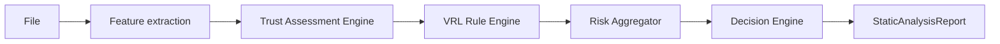

# Trust Assessment Architecture

## Pipeline

The pipeline collects evidence; it does not make a malware classification. `ALLOW` is only a next action selected by policy and never a statement that a file is safe.

## Trust Boundary

`TrustAssessmentEngine` is a framework-independent package at `packages/core/src/trust`. It produces an immutable `TrustResult` containing `trustScore` and individual indicators. Each evaluator has one responsibility and implements `TrustEvaluator`, so enterprise policy, certificate-transparency, offline catalog, or cloud-reputation implementations can be registered without modifying engine code.

The shipped evaluators are:

| Evaluator | Evidence | Constraint |
| --- | --- | --- |
| `CertificateValidator` | Valid local certificate policy result | A signature is evidence, not an allow decision. |
| `PublisherValidator` | Configured publisher subject match | Publisher names live in `database/trusted-publishers.json`, not business logic. |
| `FileLocationEvaluator` | System32, Program Files, temporary locations | Location is capped at `+8`; temporary location is context only, not a malware verdict. |
| `VersionValidator` | Consistent company, product, original filename, and version | It emits nothing when version metadata is unavailable or inconsistent. |
| `InstallationContextEvaluator` | An injected installer/platform context | Context is supplied by a future installer or endpoint plugin; it is never guessed from a vendor name. |
| `HashReputationEvaluator` | A trusted hash from an injected `HashReputationProvider` | The provider is a port only; no cloud request is implemented. |

The current local adapter supplies signature status, file location, and local hash reputation. It deliberately does not infer an installer source or invent version metadata. Those facts must be provided by future feature extractors/plugins before they can influence trust.

## Aggregation

The report keeps separate values:

- `riskScore`: bounded sum of matched VRL rule scores.
- `trustScore`: bounded total of trust indicators.
- `overallScore`: risk after limited, risk-sensitive trust attenuation.
- `confidence`: evidence-volume measure for policy and future enterprise use.

Trust is not directly subtracted from risk. The current policy is:

$$
O = round(R \times (1 - min(0.30, \frac{T}{100} \times (0.15 + 0.25 \times (1 - \frac{R}{100})))))
$$

where $R$ is risk, $T$ is trust, and $O$ is overall score. Trust can attenuate at most 30% of risk, and its effect diminishes as risk rises. This keeps several strong suspicious indicators actionable even when a file has a known publisher, valid signature, trusted hash, or privileged location.

## Decision Policy

`DecisionEngine` owns next-action selection. It calculates a risk-based baseline, then selects the highest escalation from that baseline and any matched rule recommendation:

`ALLOW < MONITOR < SANDBOX < AI_ANALYSIS`

An `ALLOW` recommendation cannot lower a `MONITOR`, `SANDBOX`, or `AI_ANALYSIS` baseline. High risk is therefore never downgraded by a positive trust signal or legacy allow rule. The default policy allows low-risk files, permits a narrow low-risk/trusted band, monitors medium risk, sandboxes high risk, and preserves explicit higher rule escalations. Future enterprise policies can inject another `DecisionEngine` policy without changing extraction or trust plugins.

## Compatibility

`StaticAnalysisReport` retains `fileHash`, `riskScore`, `recommendation`, `matchedRules`, `indicators`, and `metadata`. It adds `trustScore`, `overallScore`, `confidence`, and `trustIndicators`. Existing API fields remain available; the loopback API and desktop types expose the additional scores additively.

The obsolete `TrustedMicrosoftPublisher` VRL rule was removed because it embedded a vendor name, lowered risk, and emitted `ALLOW`. Equivalent publisher evidence is now configuration-driven and cannot de-escalate suspicious rule findings.

## Verification

Focused tests cover immutable trust results, configurable publishers, file-location limits, hash-provider injection, concurrent reputation persistence, trust-to-pipeline wiring, bounded trust influence, explicit escalation precedence, and prevention of high-risk de-escalation. The full engine and desktop builds validate the integration boundary.